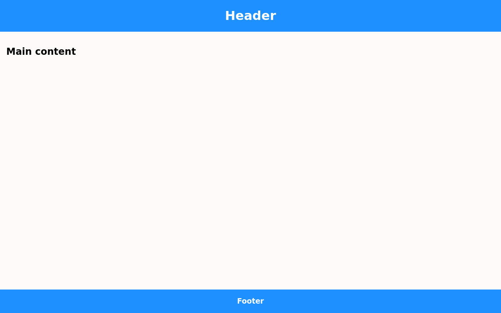

<h1>Structure 00: Header, Main, and Footer</h1>

The target structure is oriented vertically, and segmented in three parts:
header, main, and footer.

<h2>Useful Resources</h2>

<ul>

<li>
<a href="https://css-tricks.com/boxes-fill-height-dont-squish/">
Boxes That Fill Height
</a>
</li>

<li>
<a href="https://www.w3.org/Style/Examples/007/center.en.html#text">
Centering Things
</a>
</li>

<li>
<a href="https://moderncss.dev/keep-the-footer-at-the-bottom-flexbox-vs-grid/">
Keep the Footer at the Bottom: Flexbox vs. Grid
</a>
</li>

<li>
<a href="https://www.sitepoint.com/understanding-and-using-rem-units-in-css/">
Understanding and Using rem Units in CSS
</a>
</li>

</ul>
